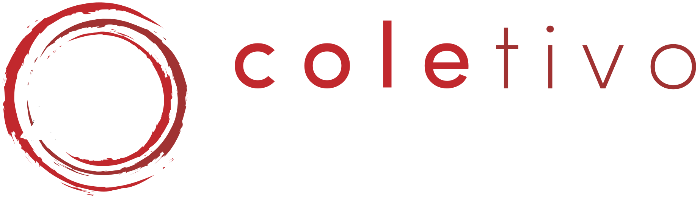

<head title="Coletivo Amígdalas"></head>
<link rel="stylesheet" href="https://cdnjs.cloudflare.com/ajax/libs/font-awesome/4.7.0/css/font-awesome.min.css">
<link rel="stylesheet" href="./styles/css.css">
<link rel="stylesheet" href="./styles/agenda.css">

 


<x onclick="window.location.href = 'https://www.instagram.com/coletivo_amigdalas/'" class="fa fa-instagram"></x>
<x onclick="window.location.href = 'https://www.facebook.com/Coletivo-Am%C3%ADgdalas-104712007882184/'" class="fa fa-facebook-f"></x>
<x onclick="window.location.href = 'https://www.youtube.com/channel/UCig7BqOgl6cLp-fJi2fRQFw'" class="fa fa-youtube"></x>
<x onclick="window.location.href = 'mailto:coletivoamigdalas2017@gmail.com'" class="fa fa-envelope"></x>

